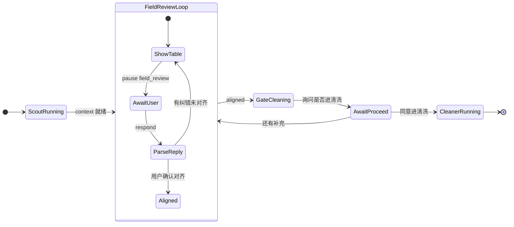

# 多轮对齐式人机互动 — 方案与实施计划

> **定位**：把「互动」从**单次 `respond` 过门**推进为**阶段内可对齐、对齐后再放行**；与 [PROJECT.md](../PROJECT.md)「人机互动理念」一致，并显式区分**当前实现缺口**。  
> **真相源**：产品原则仍以 [PROJECT.md](../PROJECT.md) 为准；本文件为**可执行的工程方案 + 分期计划**。

---

## 1. 目标（用户定义的「互动」）

在 **Scout 字段理解**等关键阶段，系统应支持：

1. **展示**当前理解（结构化 `field_review` 为主载荷，保留）。
2. **询问**用户是否认可（话术可短、可关、不得复述表格已呈现的可核验事实）。
3. 用户若**不认可**：允许**多轮**澄清——用户可直接指出要改的字段/含义，或回答「哪里不对」类追问。
4. **每次有效修改后**：必须**再次展示**更新后的理解（刷新同一结构化载体或等价视图），并再次询问是否认可。
5. **仅在用户表达已对齐**后，才进入**下一阶段征得同意**（例如进入清洗），且须保留「暂不进 / 还有补充」的出口。
6. **不预设「用户只能答几次」**：结束条件为**对齐与放行意图**，不是固定回合数。

> **与 LLM 的关系**：LLM 负责**依当次上下文**生成短引导、澄清问法、解析自然语言纠错（在已有确定性解析器之外可作辅助，但**写库/改 context**须走已验证路径）；**不得**用长模板顶替结构化事实。

---

## 2. 实现对照（锚点，随 PR 更新）

### 2.1 Scout 字段理解（Web 全量路径 `Orchestrator.run`）

| 维度 | 2026-05-14 之前 | **2026-05-14 起（已落地）** |
|------|-----------------|------------------------------|
| Scout 暂停 | 单次 `_pause_and_wait` | **多轮**：`while not _is_scout_aligned` 内反复 `pause → apply → 再 pause`；载荷含 **`interaction_revision`**（递增） |
| 纠错后再展示 | 无第二次 `field_review` | **有**：未对齐则 `revision+1` 后再发 `user_input_requested`（同表刷新语义） |
| 未对齐进清洗 | 单次回复后即 `cleaner.run()` | **不会**：仅当 `_is_scout_aligned` 为真才跳出循环再 `AGENT_COMPLETED` → Cleaner |
| 对齐判定（当前工程） | — | **二选一**：`_scout_reply_is_pure_confirm`（含空串）**或** 全部 `column_semantics[].needs_user_input=False`（结构化纠错命中列时会置 `False`，见 `apply_scout_user_field_reply_to_context`） |

### 2.2 仍属缺口（与 §1 目标相比）

| 缺口 | 说明 |
|------|------|
| **Phase 0 未书面闭合** | 口语「对齐」词表仍主要依赖 `_scout_reply_is_pure_confirm` 正则；**「可以了」等**若未写入词表，在仍有 `needs_user_input=True` 时会**继续循环暂停**（用户须改字段或发已支持短句，或点「重置分析」）。产品应在 Phase 0 定稿词表或改为显式 intent。 |

**结论**：Scout **阶段内多轮对齐**、**跨阶段闸门**与 **Cleaner / Analyst 阶段内多轮 + 显式放行（C5）**已具备工程形态；Phase 0 词表书面闭合等仍按 §5 推进。

### 2.3 Cleaner / Analyst（同路径）

| 维度 | 之前 | **2026-05-14 起（已落地）** |
|------|------|------------------------------|
| 阶段内暂停 | 单次 `_pause_and_wait` | **多轮**：`while` 内反复暂停直至放行短语；载荷含递增 **`interaction_revision`** |
| 出阶段条件 | 任意一句回复即继续 | **须** `_cleaner_reply_accepts_proceed` / `_analyst_reply_accepts_proceed`（契约 **C5**） |

---

## 3. 方案概要（架构层）

### 3.1 核心改动一句话

**把「暂停点」从「单事件 + 单次 unblock」升级为「阶段子状态机」**：子状态机内允许多次 `USER_INPUT_REQUESTED` / 多次 `respond`，直到 `aligned` 或用户明确 `abort`；**跨阶段**再设 `gate_to_cleaning` 等显式闸门。

### 3.2 状态机（逻辑示意）

> **实现注**：不必第一版就上全图所有分支；可按 **§5 分期**先落地 Scout **「纠错 → 再展示 → 再问」**最小闭环，再扩展到「进清洗前显式同意」。

### 3.3 与现有组件的边界

| 组件 | 职责（方案期约定） |
|------|---------------------|
| **Orchestrator** | 持有阶段子状态；决定在何事件上再次 `emit USER_INPUT_REQUESTED`；**禁止**在未对齐时调用下一阶段 `*.run()`。 |
| **ScoutAgent / 纯函数** | 继续产出/更新 `context`；**可**复用 `scout_field_review_pause_payload`、`apply_scout_user_field_reply_to_context`；是否「已对齐」的判定规则要**可测、可文档化**（避免全靠 LLM 猜）。 |
| **WS** | 协议可保持 `respond` + `text`；**或**扩展 payload（如 `phase_key` / `intent`）以便编排区分「纠错」与「确认放行」——**须版本化与向后兼容策略**（见 §6 风险）。 |
| **hagoku_web AnalyzePanel** | 能区分**同一 Scout 暂停的多轮**：表格数据更新、输入区保持、**不**误清空已对齐的中间态；快捷按钮与「一句确认」语义与后端子状态一致。 |

---

## 4. 验收标准（分期对应）

### A. Scout 多轮（P0）

- [x] 用户第一次回复**纠错**后，**再次**收到带 **更新后 `field_review`** 的 `user_input_requested`（载荷字段 **`interaction_revision`** 递增）。
- [x] 用户明确「仍不对」且未消掉 `needs_user_input` 时，**不会**进入 `cleaner.run()`（编排 `while` 未退出）。
- [x] 用户明确「对齐/可以往下」后，**先**出现 **进入清洗**的显式闸门（见 B）；`gate_cleaning_pause_payload` + `_is_gate_confirm` + AnalyzePanel gate UI 已落地。
- [x] **pytest**：`_is_scout_aligned`、payload 带 `interaction_revision`、闸门 `_is_gate_confirm` 等见 `tests/test_product/test_agent_interaction_contract.py`（**不依赖**真实 LLM）。

### B. 跨阶段闸门（P1）

- [x] Scout 对齐后、进入 Cleaner 前，有**显式** `user_input_requested`（载荷含 `gate.phase="cleaning"` 与 `gate.prompt`；AnalyzePanel 展示「确认进入清洗」/「还有补充」按钮）。
- [x] 用户拒绝进入清洗（回复含「补充/还有/改」）时，回 **FieldReviewLoop**（编排外层 `continue`）；纯确认 / 空 → 进 Cleaner。Cleaner / Analyst 同构见 §4-C。

### C. Cleaner / Analyst 同构（P2）

- [x] Cleaner、Analyst 暂停点按同一「子状态机 + 再展示 + 显式放行」模式收敛（载荷 `interaction_revision`；Web 原地更新工作流表；契约 **C5**）。

### D. 文档与契约（横切）

- [x] [AGENT_INTERACTION_CONTRACT.md](AGENT_INTERACTION_CONTRACT.md) **C4** 已含闸门行为（禁止 Scout 未对齐时调用 `cleaner.run()`；闸门拒绝回 FieldReviewLoop）；Cleaner / Analyst 同构随 §4-C 继续扩 C4 条文。
- [x] [docs/DEVELOPMENT.md](DEVELOPMENT.md)「分析流程与人机互动」已链本文件与目标态。

---

## 5. 实施计划（建议分期）

### Phase 0 — 定规与场景（1–2 天）

- 产品拍板：**「对齐」的判定规则**（纯确认正则 / 显式关键词 / 结构化 intent 字段三选一或组合）。
- 书面列出 **3 条场景剧本**（仅 Markdown，评审用）：纯确认、一轮纠错再确认、拒绝进清洗再补充。
- **状态（2026-05-14）**：**代码侧已用** `_scout_reply_is_pure_confirm` +「全列 `needs_user_input=False`」**实现一版**；**书面词表与 3 条剧本仍建议补**，以闭合产品与客服/培训口径（见 §2.2 缺口）。

### Phase 1 — Scout 子状态机 + 编排（核心，3–7 天）

- **状态（2026-05-14）**：已在 `Orchestrator.run` Scout 段落地 `while` + `_is_scout_aligned` + `interaction_revision`；单测见 `test_agent_interaction_contract.py`（`_is_scout_aligned`、revision 注入等）。

### Phase 2 — Web 前端（2–5 天）

- **状态（2026-05-14）**：`AnalyzePanel` 已按 `interaction_revision` **原地更新**同一张 `field_review` 卡片（不堆叠）；与 Phase 0 文案可继续迭代。

### Phase 3 — 跨阶段闸门 + Cleaner/Analyst 同构（各 3–10 天，可并行设计）

- 实现 §4-B、§4-C；每阶段合并前跑全量 `pytest tests/test_product/` 与 Web 手动步骤（见 DEVELOPMENT.md）。

### Phase 4 — LLM 短引导（可选增强）

- 在 `message` 或独立 `llm_blurb` 字段中注入 **llm_quick** 生成内容：默认折叠、字数上限、**单元测试禁止复述表格数字**（启发式或快照测）。

---

## 6. 风险与依赖

| 风险 | 缓解 |
|------|------|
| WS 客户端假设「每阶段只停一次」 | 前端全面搜 `user_input_requested` 处理路径；加 `interaction_revision`。 |
| 与「反冒充对话」张力 | 短 `message` / `llm_blurb` 与表分离；契约测控制长度与禁复述。 |
| 编排线程阻塞时间变长 | 保留 `cancel_analysis`；每轮子状态超时策略（可选）。 |
| 与 PROJECT「单线程每暂停点只 respond 一次」旧表述冲突 | **以本方案为准更新 PROJECT.md 相关句**（实施 Phase 1 合并时同步 PR）。 |

---

## 7. 文档维护

| 动作 | 负责文件 |
|------|----------|
| 方案迭代 | 本文件 `docs/INTERACTION_MULTITURN_PLAN.md` |
| 路线图勾选 | [DEVELOPMENT_PROMPT.md](../DEVELOPMENT_PROMPT.md) 本节交叉引用 |
| 契约与测试 | [AGENT_INTERACTION_CONTRACT.md](AGENT_INTERACTION_CONTRACT.md) |
| UI 改动记录 | [UI_CHANGELOG.md](../UI_CHANGELOG.md)（有界面变更时） |

**最后更新**：2026-05-14 — 同步 **Scout 多轮已落地**、§2/§4/§5 状态；§2.2 列剩余缺口与已知边角。
